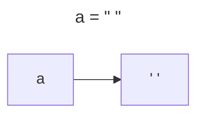
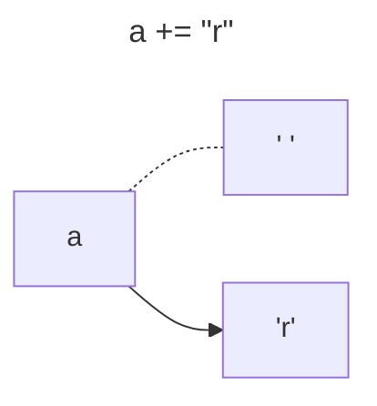
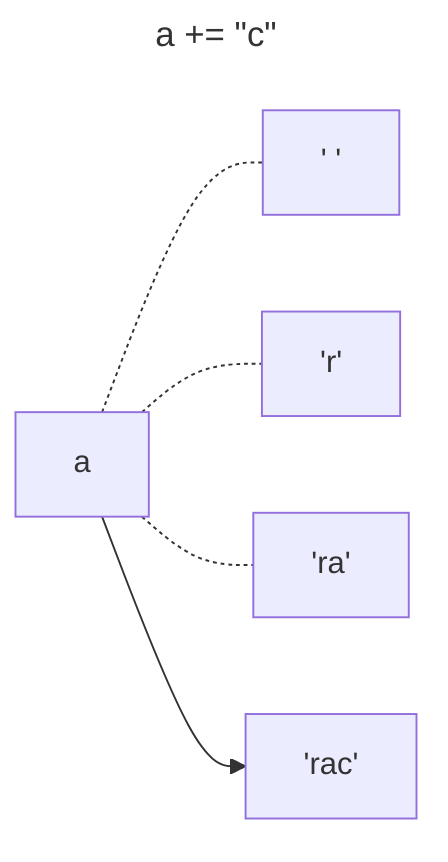
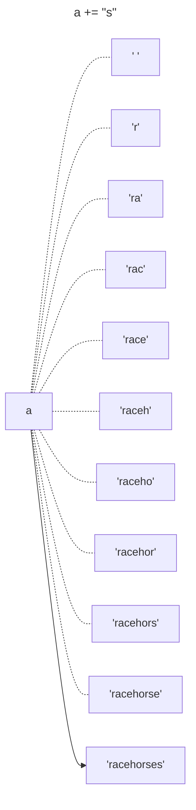
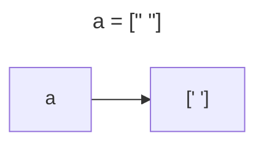
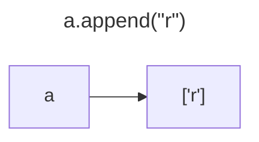
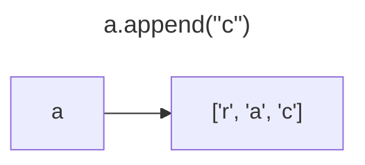
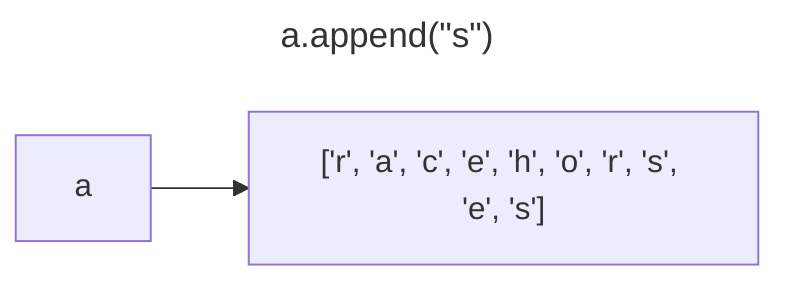

# Contents

- [Project Overview](#project-overview)
- [Ciphers Included](#ciphers-included)
- [Reverse Cipher](#reverse-cipher)
- [Caesar Cipher](#caesar-cipher)
- [Transposition Cipher](#transposition-cipher)
- [Simple Substitution Cipher](#simple-substitution-cipher)
  - [Incrementally Growing a Message with a String](#incrementally-growing-a-message-with-a-string)
  - [Incrementally Growing a Message with a List](#incrementally-growing-a-message-with-a-list)
- [Vigenere Cipher](#vigenere-cipher)
- [One Time Pad Cipher](#one-time-pad-cipher)

# Project Overview

The purpose of this 'cipher project' is to implement several different common ciphers that can encrypt or decrypt a given text. None of these ciphers are new. They all have been written many times before by many others. Instead of originality, I am setting out to write these ciphers in order to get practice with writing code in Python. Where possible, I will try to add my own flair. 
As a disclaimer, I am writing this project in the same order as the book that I am following to write this code - ["Cracking Codes with Python" by Al Sweigart](https://inventwithpython.com/cracking/). Al Sweigart teaches Python in this book by showing his way of implementing certain ciphers. While I will consult his solutions, I will ultimately be writing my own and not simply copying his. I appreciate his desire to help others learn Python by providing many of his books for free online at [inventwithpython.com](https://inventwithpython.com/). 

# Ciphers Included

(Sorted alphabetically)

| Cipher Name    | Description |
| --- | --- |
| Caesar Cipher | Takes a message and a key. The key shifts each character that many times to the right for encryption or to the left for decryption. |
| One Time Pad Cipher | Same as Vigenere Cipher but the random key is as long as the message. |
| Reverse Cipher | Does not change any element of the message. Simply reverses the elements in the message. For this reason, the same function can perform both encryption and decryption. |
| Simple Substitution Cipher | Maps each letter to a new character. Harder to brute force than Transposition, Reverse, or Caesar ciphers. |
| Transposition Cipher | Takes a message and a key. Creates a list with a number of strings equal to the key and loops the message adding characters to the strings. Joins them all together at the end for a scrambled message. |
| Vigenere Cipher | Repeats a Caesar Cipher multiple times but each letter of the key encrypts or decrypts with a different value. |

# Reverse Cipher

The `reverse_cipher()` function is relatively simple and works by going from the end of the message and working towards the beginning. 

``` python
def reverse_cipher(message):
    new_message = ""
    i = len(message) - 1
    while i >= 0:
        new_message += message[i]
        i -= 1
    return new_message
```

### Usage

Here is the message before being inserted into the reverse cipher:

> "Here is a good example of the reverse cipher at work. Notice that the inclusion of punctuation (like ! or . or ?) is a dead give-away that the message is simply backwards."

Here is the result:

> ".sdrawkcab ylpmis si egassem eht taht yawa-evig daed a si )? ro . ro ! ekil( noitautcnup fo noisulcni eht taht ecitoN .krow ta rehpic esrever eht fo elpmaxe doog a si ereH"

If you wanted to decrypt that same message, you get the same as the original:

> "Here is a good example of the reverse cipher at work. Notice that the inclusion of punctuation (like ! or . or ?) is a dead give-away that the message is simply backwards."

### Second Version

While the reverse cipher can trick the eyes for a quick moment, I personally think that it is a dead give-away to have either punctuation or capital letters. I decided to create a second version of the reverse cipher called `reverse_without_punctuation()` that drops all punctuation and makes all letters lowercase. This is even harder for the eyes to detect what is going on. Only by going character by character can someone catch a pattern in a unique common word and realize that the message is just backwards. This solution requires `import string` in the file.

``` python
def reverse_without_punctuation(message):
    new_message = ""
    i = len(message) - 1
    while i >= 0:
        if message[i] in string.ascii_letters:
            new_message += (message[i]).lower()
        i -= 1
    return new_message
```

Here is the next message before being inserted:

> "This reverse function removes punctuation and makes sure all characters are lowercase. In my opinion, this makes the cipher less obvious. The side effect is that decrypting the message results in a message without punctuation or spaces. This is harder to read than usual but still doable."

As you can see, the result of the encryption does not immediately gives itself away and could possibly be interpreted as a series of random characters if not observed closely:

> "elbaodllitstublausunahtdaerotredrahsisihtsecapsronoitautcnuptuohtiwegassemanistluseregassemehtgnitpyrcedtahtsitceffeedisehtsuoivbosselrehpicehtsekamsihtnoinipoymniesacrewolerasretcarahcllaerussekamdnanoitautcnupsevomernoitcnufesreversiht"

The only problem with this method is that on decryption the message still does not have punctuation. The words run together. While this is an unfortunate side effect, I believe that it is worth the extra chance that someone wouldn't be able to understand the encrypted message:

> "thisreversefunctionremovespunctuationandmakessureallcharactersarelowercaseinmyopinionthismakesthecipherlessobviousthesideeffectisthatdecryptingthemessageresultsinamessagewithoutpunctuationorspacesthisishardertoreadthanusualbutstilldoable"

# Caesar Cipher

The Caesar Cipher is more complex than the Reverse Cipher although it is overall simple to implement. It works by taking in a message and a cipher key. The code loops over each individual letter or character in the original message and finds its index value in a string called `CHARACTERS` of all uppercase and lowercase letters, the numbers 0 through 9, and the space character. Once the index is found, it is modified by adding the cipher key to it in encryption mode or subtracting it in decryption mode. Finally, the modified index is used to find the transposed character from the `CHARACTERS` string. After each value is adjusted, it is added to the new message, which is returned after the loop is completed. One thing that I like about this implementation is that it uses the space character in the `CHARACTERS` string and treats uppercase and lowercase separately. This means that it is difficult to tell the natural breaks in the words which is how you might break the code without a key. 

Plaintext example:
> "This Caesar Cipher really is cool! It is definitely more secure than the Reverse Cipher. In my opinion, it has a cool look to it as well because of mixing in numbers in the CHARACTERS string."

Encryption with cipher key 13:
> "guv4CPnr4n3CPv1ur3C3rnyyACv4Cp00y!CV5Cv4Cqrsv v5ryACz03rC4rp63rC5un C5urCer7r34rCPv1ur3.CV CzAC01v v0 ,Cv5Cun4CnCp00yCy00xC50Cv5Cn4C8ryyCorpn64rC0sCzv9v tCv C 6zor34Cv C5urCPUNeNPgRefC453v t."

Encryption with cipher key 31:
> "yBCMUh48M4LUhCJB8LUL84FFSUCMU6IIF!UnNUCMU789CHCN8FSUGIL8UM86OL8UNB4HUNB8Uw8P8LM8UhCJB8L.UnHUGSUIJCHCIH,UCNUB4MU4U6IIFUFIIEUNIUCNU4MUQ8FFU5864OM8UI9UGCRCHAUCHUHOG58LMUCHUNB8UhmfwfhyjwxUMNLCHA."

You might notice that the appearance of the encryption can affected heavily by the value of the cipher key. This could provide you with a little bit of fun with customization. You could find a couple cipher keys that produce a style of output that you like and use those keys when you encrypt your messages. I ran the code:

``` python
for i in range(63):
    print(f"i: {i}    " + caesar_cipher(m, "encrypt", i))
```

where m was a message I defined earlier. I particularly liked the look of the key values 8, 47, 56, and 62.

# Transposition Cipher

The Transposition Cipher is even more secure than the Caesar Cipher. This is because its encrypted state depends on the key length and the length of the message. Its `encrypt()` function takes a cipher key and a message. The cipher key must be a number 2 or greater and less than or equal to half the length of the message. This limits the message that can be used by requiring that it is at least 4 characters. This is not a bad limitation however because there is not a lot of information that you could convey with a message less than 4 characters. Conceptually, the cipher works by creating a series of rows and columns. The rows and columns aren't actually made but it is part of how the solution is visualized. If you were doing the solution, you would create rows with the amount of slots equal to the cipher key. You would then assign each character to a slot in the row. When then row became filled, you would add a new row beneath. After all of the characters from the message were added into this table of rows, you would then go top to bottom by column and add up all the characters to make the encrypted message. 
In his book, Al Sweigart's implementation seemed to follow this concept closely but I felt that this made the code more confusing. I simplified it by creating a series of strings inside a list. I then looped through the message while adding the characters to the different strings until there were no characters left. If you want to see the way Al Sweigart did it, go to [his website](https://inventwithpython.com/cracking/chapter7.html). His website also gives a more thorough explanation of how the cipher works. 

Here is a message before encryption:
> "I think that the Transcription Cipher is very fascinating conceptually. I really recommend that you go visit Al Sweigart's website to get a better understanding of how it works. I found it difficult to explain the concept as well as he did in his book."

Here is the same message encrypted with a key of 2:
> "Itikta h rncito ihri eyfsiaigcnetal.Iral eomn htyug ii lSegr' est ogtabte nesadn fhwi ok.Ifudi ifcl oepantecneta ela eddi i ok hn htteTasrpinCpe svr acntn ocpuly  elyrcmedta o ovstA wiatswbiet e  etrudrtnigo o twrs  on tdfiutt xli h ocp swl sh i nhsbo."

With a key of 12:
> "I irsnIoy 'oediffpnli tp cc moAs ritoilc nthtiiermul g n ucaea heisnpee  weugwnuipshi o atangSetn odlnt inTnvtuldowb dor t  hskr eial  esaefki tae  aCrnlytvii r stths btniygl higtbsh. oe dohsp  yrasaeeto d  wioachfc.etir tawIiecedktreao c ttttn  fxol ."

### Refactoring 

My original solution was more complex than necessary. I had used a while loop along with an incremented variable that tracked whatever the current character was. After revisiting this code later in the day, I realized that this is the main purpose of a `for` loop instead of a `while` loop. A `while` loop is good for repeating a set of instructions an unknown number of times while a `for` loop is good for performing an exact number of repetitions. This is the case for looping through every character in a message. You can see below how the refactored version simplified the code and made it more readable.

Original:

``` python
def encrypt(ckey, message):
    if ckey < 2 or ckey > (len(message)/2):
        return ERROR_MESSAGE
    message_list = [""] * ckey
    current_string = 0
    current_character = 0
    while current_character < len(message):
        message_list[current_string] += message[current_character]
        current_character += 1
        current_string += 1
        if current_string > (ckey - 1):
            current_string = 0
    return "".join(message_list)
```

Refactored:

``` python
def encrypt(ckey, message):
    if ckey < 2 or ckey > (len(message)/2):
        return ERROR_MESSAGE
    message_list = [""] * ckey
    current_string = 0
    for character in message:
        message_list[current_string] += character
        current_string += 1
        if current_string > (ckey - 1):
            current_string = 0
    return "".join(message_list)
```

Despite a simplification, these two segments of code perform the same task.

### Decryption

The decryption of the Transcription Cipher is more complex than the encryption. When I began writing it, it was almost identical to the encryption function. However, despite working out several examples on a whiteboard, I was still getting errors in my decryption. Eventually, I realized that it was because of the final column or string in the list. When the message is encrypted, it almost always will end with the final column shorter than the rest. If you don't account for this when decrypting, none of the columns will line up correctly. The solution is to check if the final column is as long as it should be. This is done by setting the expected length of the final column to be the remainder of the length of the message divided by the key. Once the final column is the expected length, it is not allowed to recieve any more characters. This corrected the errors of my early solution. I included several comments in the decryption code to inform others about this irregularity, as I felt that it was not immediately apparent. Below is a copy of the decryption function.

``` python
def decrypt(ckey, message):
    if not check_key_size(ckey, len(message)):
        return ERROR_MESSAGE
    columns = math.ceil(len(message) / ckey)
    message_list = [""] * columns
    current_column = 0
    #while use last column is true, characters will be added to last column
    use_last_column = True
    #last column length is how many characters the last column should accept
    last_column_length = len(message) % ckey
    for character in message:
        message_list[current_column] += character
        current_column += 1
        #if the last column has max characters, removes option to add to it
        #buried in second if statement to prevent continued decrement
        if use_last_column:
            if len(message_list[-1]) >= last_column_length:
                use_last_column = False
                columns -= 1
        if current_column >= columns:
            current_column = 0
    return "".join(message_list)
```

# Simple Substitution Cipher 

The Simple Substitution Cipher takes the lowercase letters `abcdefghijklmnopqrstuvwxyz` and maps each letter to a new letter using a key. An example key might be `myxdvhsocrqtbuljfnpkzeagwi` or `yhxgfojetpvkrwimaculzdnsqb`. There are 26! different combinations of keys that are possible. If the key remaps the letter "a" to the letter "b", every letter "a" in the message is replaced with the letter "b". This implementation preserves casing and punctuation, which can actually be a downside. While it is difficult to guess the key, it is possible to brute force patterns found in the encrypted message. 

Example message: 
> "The simple substitution has 26! different possible keys. This makes it impossible to guess the key in a practical amount of time. Brute force attacks have to resort to other methods."

Encrypted message using key 'yhxgfojetpvkrwimaculzdnsqb': 
> "Ibh xopjth xszxioisiofw bqx 26! voeehmhwi jfxxozth lhax. Ibox pqlhx oi opjfxxozth if dshxx ibh lha ow q jmqriorqt qpfswi fe ioph. Zmsih efmrh qiiqrlx bqkh if mhxfmi if fibhm phibfvx."

One thing that sets this program apart is the attention to the method of creating the new message. In some of my other ciphers, I created a string and added onto the string as the program went along. In this Substitution Cipher, I instead started with an empty list and appended to a list as the program progressed. Using the list method required an extra step to join the string elements together at the end, so it seems that it would take longer than working with a progressively growing string. However, in Python, when you add an element to the end of the string, you aren't actually adding an element to the end of the original string. You are making a new string that has all of the original elements and a new element added on the end. When you append an item on the end of a list in Python, you don't have to create a new list. The original list is modified. This seems like a small difference but consider what would happen if the file to be encrypted got large enough. If you encrypted a message that was 100,000 characters long, the program would create at least 100,000 different strings, each string one character longer than the previous. In contrast, with the list version of the program, it would change the same list 100,000 times. The garbage collector and memory/resource management components of the program would have to do much less work. This means that using a list instead of a string would increase the speed and decrease the resource use of this program. Look below to see a visual description of this concept. Notice how using lists creates 1 object while concatenating n items with strings creates n+1 objects.

### Incrementally Growing a Message With a String

Start with an empty string:



Add a single character:



After adding 3 characters:



After adding 10 characters:



### Incrementally Growing a Message With a List

Start with an empty list:



Add a single character:



After adding 3 characters:



After adding 10 characters:



# Vigenere Cipher

For this cipher, I was able to keep the majority of the code that I had written for the Caesar Cipher. This is because the Vigenere Cipher is the Caesar Cipher repeated multiple times. In the Caesar Cipher, a key is an integer. It is added to the index of the letter to be modified and that new value (index + key) is used to find a new letter. For example, if the key is 6 and if the letter to be encrypted is "e", its index of 4 is added to the key of 6 to make a new index of 10. The character at the 10th index of the alphabet is then found. This is the letter "k". Where the original message had an "e" there would now be a "k". The only problem with this is that every letter "e" becomes the letter "k". Certain patterns can then be detected and used to crack the code. The Vigenere Cipher prevents this from happening. Instead of the key being a single number, it is a string. Each letter of the string can be converted to an integer by finding its index in the character list. For example, if the key was "telecommunications", the first character in the message would be encrypted with a key value of 19 (from "t" in "telecommunications"). The second character would be encrypted with the key value of 4 (from "e"). This would be repeated so long as there were characters to encrypt. Each character is encrypted on a different key value so you don't have to worry about patterns being spotted.

Original message:
> "The secret meeting will take place at the Blue Fox Motel in downtown. The meeting time is five pm sharp. Meeting will then be moved to a secondary location."

Encrypted message with key "gesundheit":
> "Zlw fhjvmm qwygluk popd gdri ireuy da bak Tfhh Jwq Qgnro mv jsohgrdr. Zlw zhlxqgm lczh ma lmny st aagvh. Plibbtk qvos bakr vr tsdxj li d wmvurvueb pwvgxaia."

Notice how the word "secret" encrypts to "fhjnmm". Even though there are two "e" letters, they don't encrypt to the same value. On the other hand both the second "e" and the "t" encrypt to the letter "m". This prevents any true pattern from occurring. As a side note, I followed the method described above in the Simple Substitution Cipher for using list append instead of string concatenation to improve program efficiency.

# One Time Pad Cipher

The One Time Pad Cipher is actually a modification of the Vigenere Cipher (which is, in turn, a modification of the Caesar Cipher). Instead of having a key of any length, the key is made the same length as the message. This means a message with 100 characters will have a key of 100 characters long. Because the key is as long as the message, patterns arrising from repeating the key do not occur. It is said that this style of encryption is very hard to brute force if you don't repeat the key ever. 
This encryption is called "One Time" because you should only ever use the key one time. It has the word "Pad" in its title because it is said that they used to print out a series of keys on a paper pad. When they used the key from the top of the pad, they would tear it off the pad and throw it away so the next key was on top.
I have created a series of rules to how this cipher would be used. In this scenario that I am creating, a series of keys would be handed off ahead of time to the person that I was communicating with:

1. All messages have a 250 character limit. This is because the length of the message isn't known ahead of time. Any text beyond this will not be encrypted or decrypted properly.
2. Remove all punctuation and spaces before encrypting the message to make sure the 250 character limit is respected.
3. No numbers may be included in the message. If needed, spell out the numbers. For example, use "one" instead of "1".
4. Keys will be handed off in person one month at a time. This is to reduce the number of messages compromised in case the keys fell into the wrong hands. At most, they would be only able to understand the messages for one month. After that, they wouldn't have any further keys to encrypt or decrypt messages.
5. The key will be denoted by the date. If the date is 3/23/2023, use only the key designated for that date.
6. Only send one message per day. The key set will have one key for every day for one month. If you never reuse a key and you can only use the key for a given day, this means that it is only possible to send one message in a given day.
7. Because only one message per key set can be sent in a given day, person A will have a set of keys and person B will have a second set of keys. Both A and B will have access to both sets of keys. This allows each person to send a message in a day without reusing a key. When person A sends a message, he will encrypt with key set A. When person A recieves a message from person B, he will decrypt it with set B.
8. Instead of a period, use the word "stop" to denote the end of a sentence.
9. Include the word "end" at the end of the message to mean no other content was intended to be sent.
10. If the message is less than 250 characters, use the letter x at the very end to make sure the message is exactly 250 characters.

Example message:

> "WEWILLMEETTONIGHTATTHEBLUEFOXHOTELSTOPTHEMEETINGTIMEISEXACTLYTHREEMINUTESAFTERNINEPMSTOPMAKESURETOHOLDANEWSPAPERUNDERYOURLEFTARMANDWEARAHATSTOPWALKBYTHESOUTHENDOFTHEBUILDINGATTHEMEETINGTIMESTOPAVEHICLEWILLAPPROACHYOUANDROLLDOWNTHEWINDOWHALFWAYENDXXXX"

Key: 

> "CCDGBSGYKITUHKVSTIBACWZLIOYTUAHMGQBOBZLTXXMLDMYYMOWKIWNUVNPEZTBRWMQVNADQWXFZGISXILGNFSOAXCBXJIGVUSNNZSJLILWFCARPZZSFIYRRUEFDRGXHRNZCEDGHUCKQJLMWLKZEQQXTULJTLTEONHEYWOYXCRRLKSZYJNXFRRMANWQAUYSUTDNNOQWPJMAKONWISQEOPYANWCIZNRKMEGUCIPATMCSOGTTJQKKWXHYZPY"

Encrypted message:

> "YGZOMDSCOBMIUSBZMIUTJAAWCSDHRHVFKBTHPOEABJQPWULEFWIOQORRVPIPXMIIAQCDAUWUOXKSKZFFVPVZXLCPJCLBBCXZNGUBKVJYMHOUCPVGTMVJZWFLLPJIKGOTRACYIDXHBCDICZBSLVJFOJEXMZDMSXRRBMXFAPSFNUZYQSSRQRJJVKUNTPYMYQLIIDIRVYYANIIVZNLXJEEQWWOHWPLQBCVPSCHVPTWBZFGKNTEOMKIAKKVWMV"
